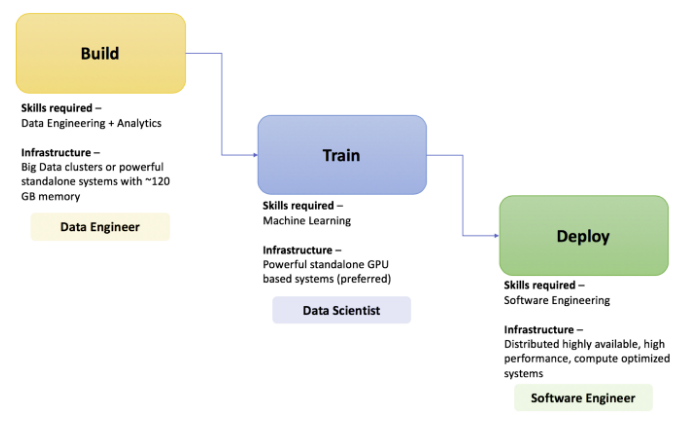
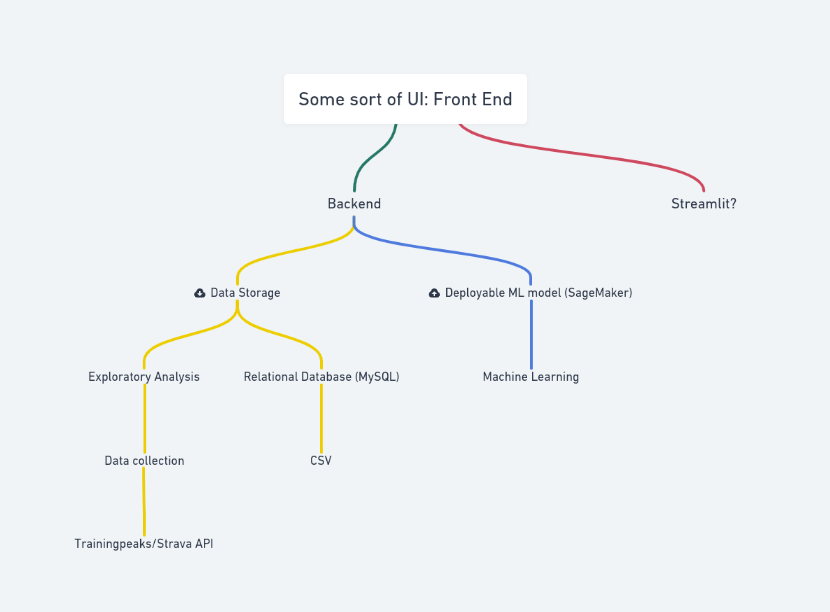

# project-cycling-CTL
Using cycling training data to predict an athletes fitness over time using a different machine learning models.

## Project Aim
The main goal of this project is to gain a surface level understanding of the workflow of deploying a machine learning model.



## Goal pipeline
As the goal of the project is to learn, each path of the workflow (Data Engineering, Machine Learning and Software Engineering) will be examined and explored.



## TODO:

### Data Engineering
- [X] Wrangle Data
   - [X] Create pipeline
   - [X] Dataframe conversion -> Direct conversion (20x faster)
   - [X] Convert from CSV storage to Relational Database storage (stuck with csv, mySQL is way too slow)
- [ ] Clean Data
- [ ] Exploratory Analysis

### Machine Learning
- [ ] Make a itterative model class
- [ ] Predict

### Software
- [ ] Deploy (somehow)

# Notes

## 1. If there are mySQL auth fails

```shell
$ sudo mysql -u root -p
And then updating the password using:

$ ALTER USER 'root'@'localhost' IDENTIFIED WITH mysql_native_password BY 'new-password';
```
Once this is done stop and start the mysql server.
```shell
$  sudo service mysql stop
$  sudo service mysql start
```
## 2. mySQL is 10x slower for data parsing
 
